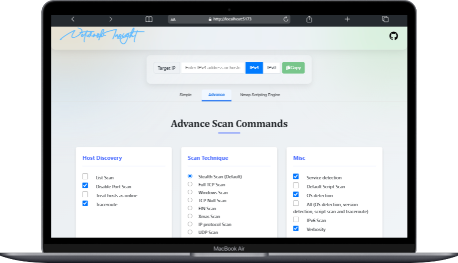
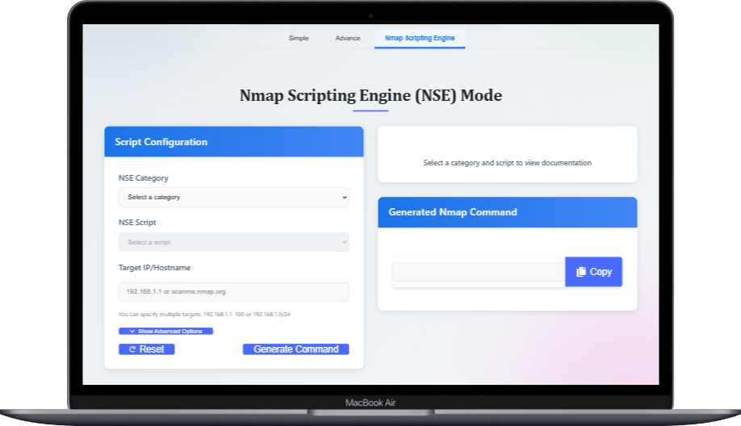
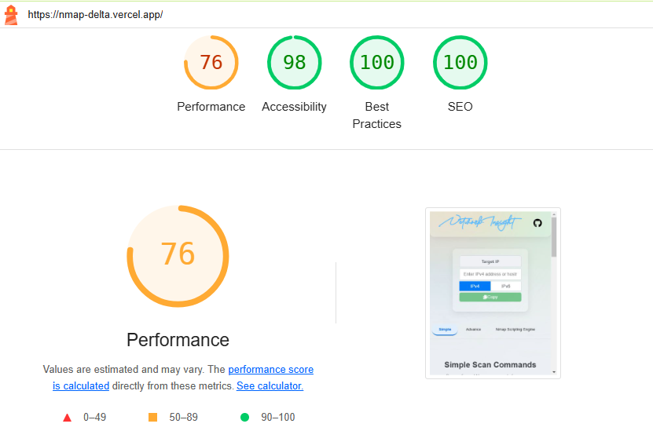

# NMAP Command Generator


---

## Overview
The NMAP Command Generator is a web application built with React to simplify the creation of NMAP commands for network scanning. It offers three modes—Basic, Advanced, and NSE—to cater to users of varying expertise, providing an intuitive interface for generating tailored NMAP commands.

- **Repository**: [https://github.com/AbdulAHAD968/NMAP-COMMAND-GENERATOR](https://github.com/AbdulAHAD968/NMAP-COMMAND-GENERATOR)
- **Live Site**: [https://nmap-delta.vercel.app/](https://nmap-delta.vercel.app/)

---

## Features
The application provides three modes for generating NMAP commands:
1. **Basic Mode**: Pre-configured, commonly used NMAP commands for quick and simple network scanning, ideal for beginners.
2. **Advanced Mode**: Customizable NMAP flags for OS detection, verbosity, and scan speed, suitable for experienced users requiring precise control.
3. **NSE Mode**: Support for NMAP Scripting Engine (NSE) scripts to perform advanced tasks like vulnerability detection and service enumeration.


---

## Additional features:
- IP input field for specifying target addresses.
- Generated commands can be copied for use in a terminal.
- Responsive and user-friendly interface.

---

## Installation
To run the NMAP Command Generator locally:

1. **Clone the Repository**:
   ```bash
   git clone https://github.com/AbdulAHAD968/NMAP-COMMAND-GENERATOR.git
   cd NMAP-COMMAND-GENERATOR
   ```

2. **Install Dependencies**:
   Ensure [Node.js](https://nodejs.org/) is installed, then run:
   ```bash
   npm install
   ```

3. **Start the Development Server**:
   ```bash
   npm start
   ```
   The application will be available at `http://localhost:3000`.

---

## Usage
1. **Access the Application**: Visit [https://nmap-delta.vercel.app/](https://nmap-delta.vercel.app/) or run locally.
2. **Enter an IP Address**: Input the target IP address for scanning.
3. **Select a Mode**:
   - **Basic**: Choose from pre-configured NMAP commands.
   - **Advanced**: Customize flags for detailed scanning options.
   - **NSE**: Select and configure NSE scripts for advanced scans.
4. **Generate and Copy**: Copy the generated NMAP command for use in a terminal.

---

## Technologies
- **Frontend**: React, JavaScript, HTML, CSS
- **State Management**: React Context API for IP input state
- **Deployment**: Vercel

---

## Project Structure
```bash
NMAP-COMMAND-GENERATOR/
├── src/
│   ├── components/
│   │   ├── IpInput.js       # IP address input field
│   │   ├── Tabs.js          # Interface for Basic, Advanced, NSE modes
│   ├── contexts/
│   │   ├── IpContext.js     # Manages IP input state
│   ├── styles/
│   │   ├── App.css          # Core application styles
│   │   ├── SimpleMode.css   # Basic mode styles
│   │   ├── AdvanceMode.css  # Advanced mode styles
│   │   ├── NSEmode.css      # NSE mode styles
│   │   ├── ip-input.css     # IP input styles
│   ├── App.js               # Main application component
├── public/
│   ├── index.html           # HTML entry point
├── package.json             # Dependencies and scripts
├── README.md                # Project documentation
```

---

## Contributing
Contributions are welcome! To contribute:
1. Fork the repository.
2. Create a new branch (`git checkout -b feature/your-feature`).
3. Make changes and commit (`git commit -m "Add your feature"`).
4. Push to the branch (`git push origin feature/your-feature`).
5. Open a pull request with a clear description of your changes.

Ensure code follows the project's style and includes relevant tests.

---

## License
Licensed under the MIT License. See the [LICENSE](LICENSE) file for details.

---

## Credits

- [x] **Author**: Abdul Ahad
- [x] **Icons**: [Flaticon](https://www.flaticon.com/free-icons/) (Icons by Flaticon)
- [x] **Images**: [Storyset](https://storyset.com/technology)

---

## Contact

For questions or feedback, reach out via [GitHub Issues](https://github.com/AbdulAHAD968/What-GPA/issues) or connect on [LinkedIn](https://www.linkedin.com/in/abdulahad-zarinc/).

---

## Images

### NMAP Advance Scan Commands (Snapshot)


### NMAP NSE Scan Commands (Snapshot)


### Lighthouse Test (Can vary - Depending on Network Connectivity)

